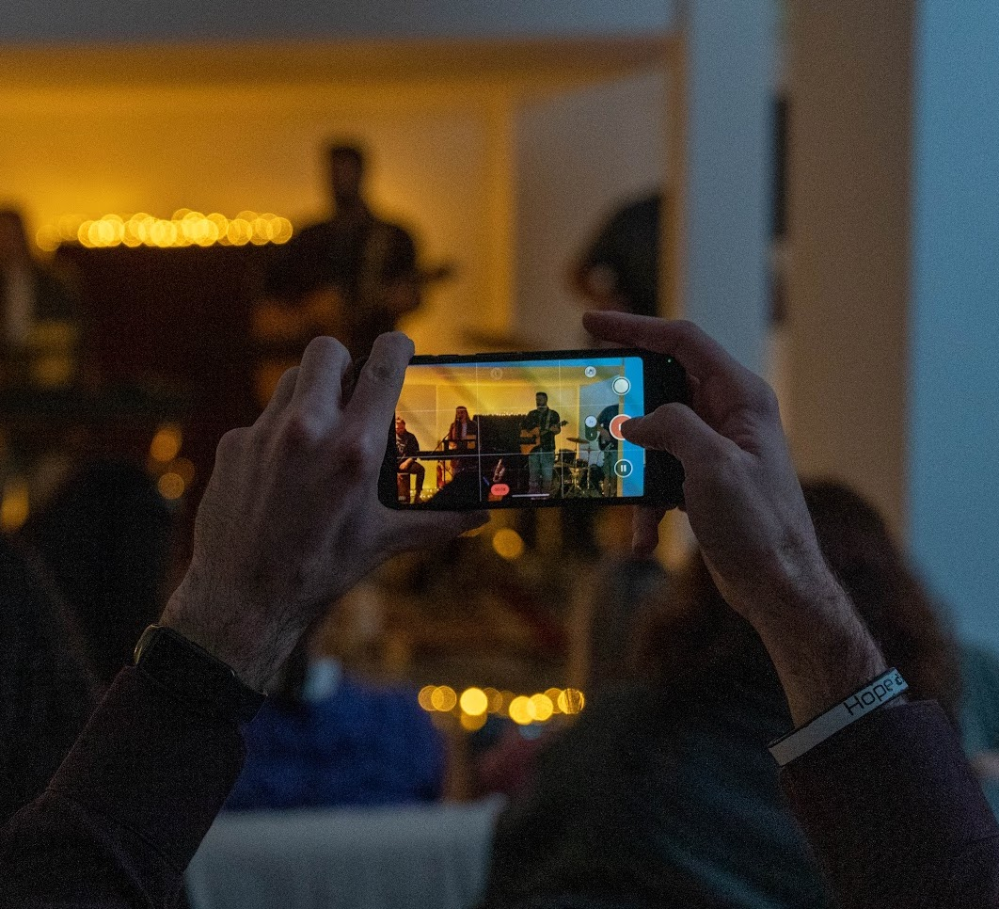

# ⚡️ Spark Youth Center

A website about Spark - a shared community space that exists for the youth in Thessaloniki to be equipped, discover their gifts and develop dreams.

## What is Spark?

Spark is a creative and open space in Thessaloniki that wants to host people and their ideas!

Spark was created out of a dream of a few young people, with love and excitement in 2022. Seeing the need for more creative social spaces for youth in our city, decided to create this initiative.

Spark is a flexible co-working and social space for creative minds, located on the ground and underground floor of a apartment building, in the quiet yet lively neighborhood next to the iconic Yeni Tzami.